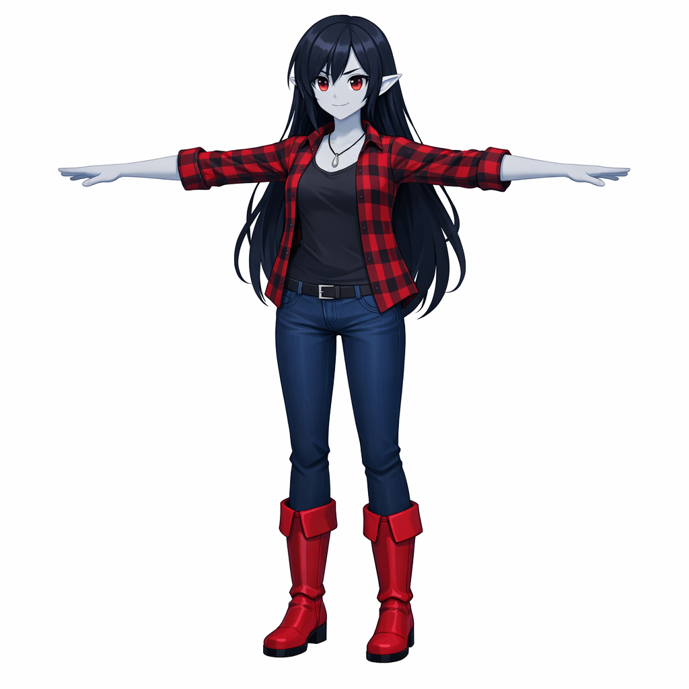
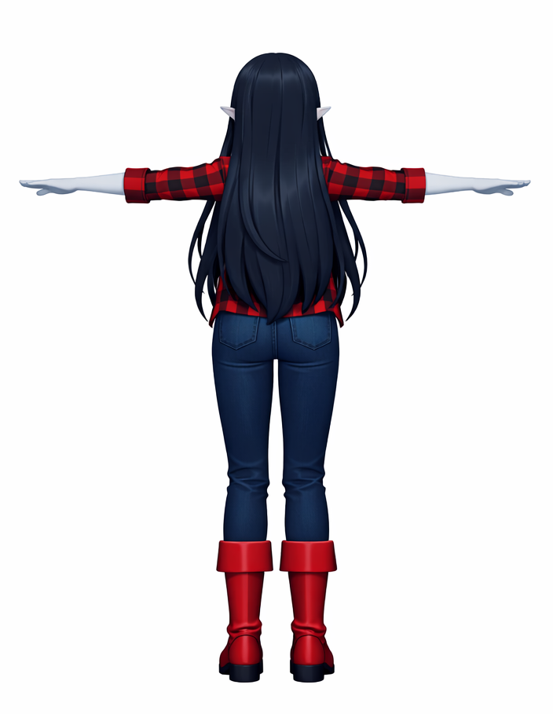
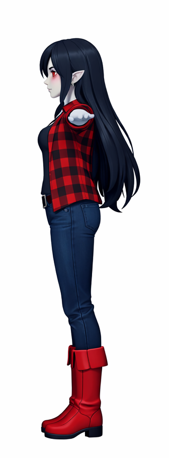
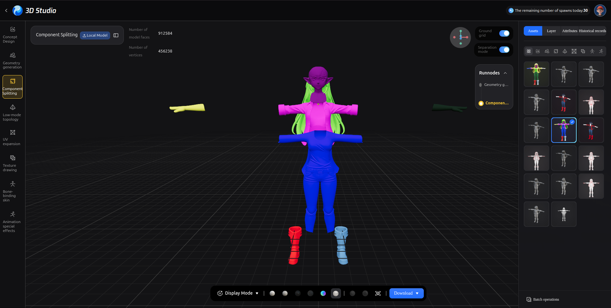
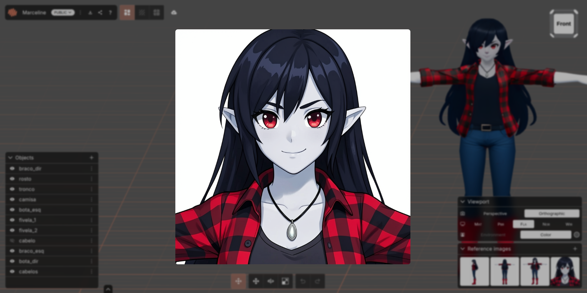
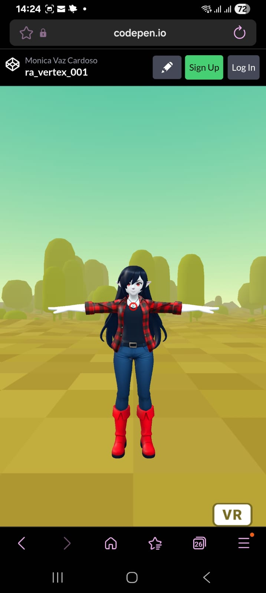

# Atividade 1: Hello World em Realidade Aumentada

Crie seu próprio modelo 3D e execute uma aplicação web simples para visualizá-lo no navegador do celular.

## Imagem de referência para o futuro modelo 3D
1. Para essa etapa solicitei ao Microsoft Copilot que criasse a personagem Marceline de hora de aventura, porém no estilo de Genshin Impact. A inteligência artificial proativamente criou vários ângulos da mesma personagem, conforme segue:




## Modelo 3D a partir da imagem de referência
1. Essa etapa foi bem desafiadora, pois as ferramentas sugeridas não estavam conseguindo reproduzir um modelo que eu considerasse adequado, então fiz uma pesquisa e encontrei alguns influencers americanos fazendo trabalhos fascinantes com a ajuda de algumas IAs  em [um vídeo comparativo entre ferramentas gratuitas versus pagas](https://www.youtube.com/watch?v=_0eZcs71W3U).
2. Dentre as ferramentas mostradas tiveram duas que me chamaram muito a atenção: o **Hunyuan3D Studio** e o **Modddiff**.

### Hunyuan3D Studio
Essa ferramenta é bem robusta. Possui um workflow bem definido de criação focado em contagem de faces e vértices, componentização (component splitting), entre outros. Facilitou e muito criar diversas variações do mesmo modelo e escolher aquela que aliava qualidade e peso de arquivo.


### Modddiff
As texturas e normal maps do Hunyuan3D Studio deixaram a desejar, mas o component splitting trouxe a possibilidade de pintar cada parte separadamente, aproveitando todo o poder do Modddiff! A ferramenta também tem um prompt dedicado onde podemos inserir referências e instruções de novas criações. Ele recriou um close up da personagem com muita consistência:


## Hospedagem no TinyGLB
Aqui um obstáculo surgiu. o modelo estava pesado demais para ser hospedado devido às inúmeras texturas criadas. Para solucionar esse problema foi necessário acrescentar o Blender a essa atividade e dar início a um processo chamado *Baking*, que consiste em unificar todas as texturas em uma só, fazendo com que o conteúdo de mais de 80MB se tranformasse em uma única imagem de 4MB. O processo de baking é explicado com maestria [nesse vídeo](https://youtu.be/cLDfVUYw4hE)!

No fim, agora o modelo estava devidamente pronto para seguir com o upload. O modelo final pode ser encontrado [nesse link](https://viewer.tinyglb.com/84236afebbf84262a370c5951d41270d) até dia **13/04/2026**.

## Configurando o projeto no CodePen
Para essa etapa fiz alteraçães na escala do modelo para estar simétrico com o ambiente, adicionei um cursor que pode ser útil para futuras interações e um environment, que combina com a temática escolhida da personagem. Você pode saber mais sobre [nesse github](https://github.com/supermedium/aframe-environment-component).

O código utilizado no codepen foi:
```html
<a-scene>
  <a-camera>
    <a-cursor material="color:red; shader:flat"></a-cursor>
  </a-camera>
  <a-entity light="type: ambient; color: #eee; intensity: 4.0;"> </a-entity>
  <a-entity
    gltf-model="https://cdn.tinyglb.com/models/bd371d2ccb6049cbab13dd9b8e63230a.glb"
    position="0 0 -3"
    scale="2 2 2"
    rotation="0 0 0">
  </a-entity>
  <a-entity environment="preset: forest"></a-entity>
</a-scene>
```

E o resultado final no meu celular foi:



### Conclusão
Foi uma tarefa desafiadora, mas gratificante onde trabalhei com 3D pela primeira vez, porém atingi resultados moderados graças ao apoio da inteligência artificial. Sem dúvidas a IA veio para trazer muito mais possibilidades para todos nós independente de onde viemos.