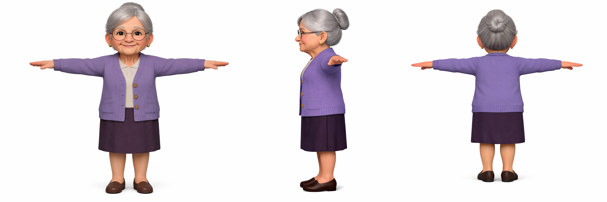
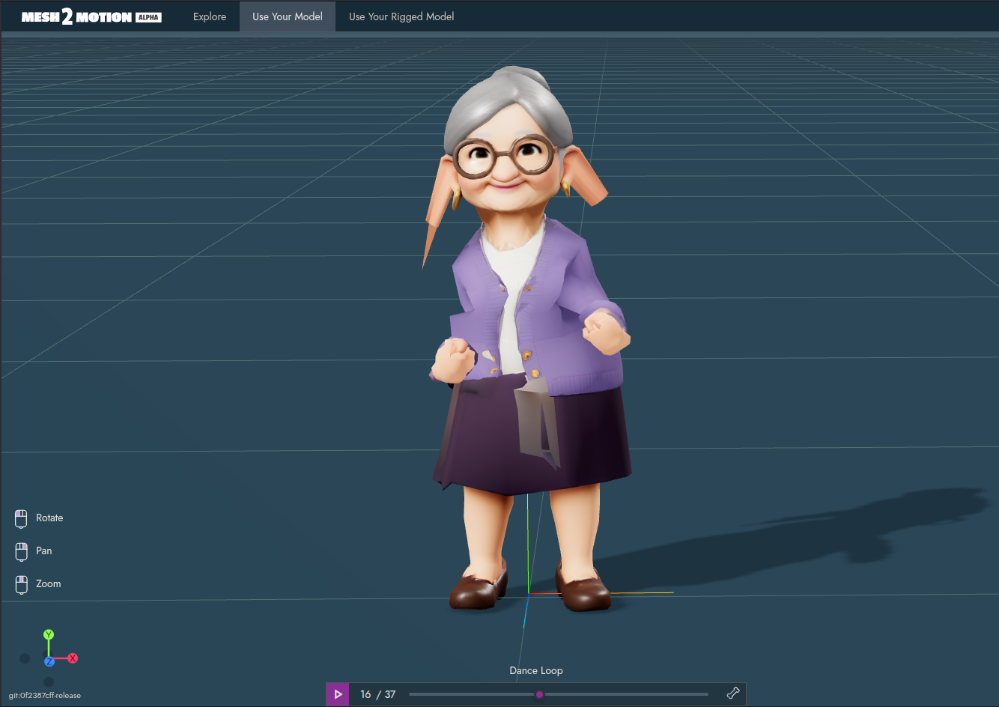
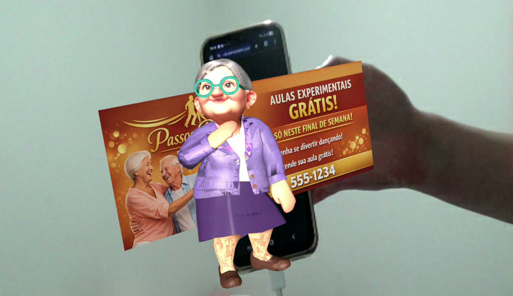
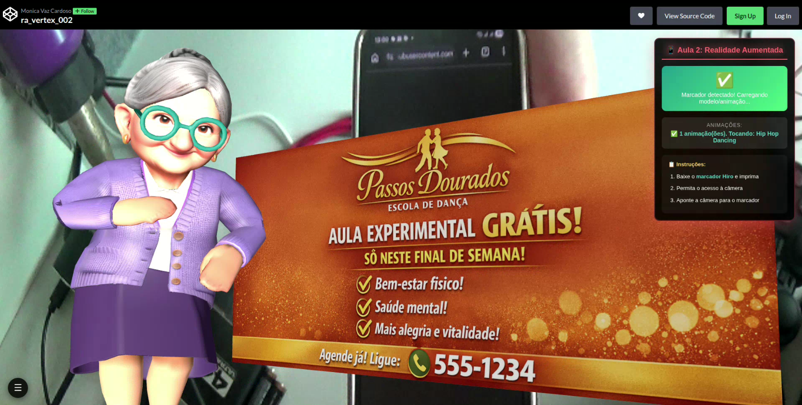

# Atividade 2: Uso de Marcadores Visuais em Realidade Aumentada

O objetivo é criar um anúncio em Realidade Aumentada para uma escola de dança ou de artes marciais. Preferi o tema de escola de dança, focando em uma personagem idosa, refletindo sobre o quando as pessoas da terceira idade também poderiam desfrutar bastante da realidade aumentada como forma de conhecer coisas novas e passar o tempo.

## Imagem de referência para o futuro modelo 3D
1. Para essa etapa solicitei ao Microsoft Copilot que criasse uma personagem idosa com semblante amigável e acolhedor. Já solicitei vários ângulos da mesma personagem, conforme segue:


## Modelo GLB animado
1. A ideia era que essa etapa não fosse muito diferente da usada na tarefa anterior, apenas acrescentando o processo de rigging. Porém na prática, assim que o mesmo precisou ser animado a ficha caiu de que eu ainda tinha muito o que aprender ao se tratar de modelagem 3D, já que no **Mesh2Motion** a personagem acabou assim:


A partir desse ponto eu tentei fazer o rigging manualmente no blender e tudo parecia correto, porém fazer o mapeamento dos bones no site sem ter familiaridade com os nomes naquela lista enorme de partes se mostrou um grande desafio e no final infelizmente o personagem permaneceu congelado no Mesh2Motion. Minha melhor alternativa depois de tantas opções darem errado era procurar por soluções diferentes, como importar as animações direto no Blender e atrelá-las ao meu modelo. Segundo a sábia internet, existia uma aplicação online ótima para isso chamada **Mixamo**.

### Mixamo
A ideia era apenas copiar uma animação e voltar ao Blender, mas durante o uso do site percebi que poderia usar meu modelo sem rigging e o próprio site faria um rigging próprio para aplicar suas animações, decidi testar. Esse foi um dos momentos mais divertidos do processo, quando consegui ver minha personagem animada sem erros e eram inúmeras possibilidades diferentes de animação. Após escolher um loop que representasse minha ideia, esse foi o resultado visualizando com o Babylon:  


## Configurando o projeto no CodePen
Para essa etapa fiz alteraçães na orientação do modelo a partir da visão superior para a visão lateral, assim os movimentos de dança ficariam mais claros e em uma situação real eu conseguiria aumentar as chances de obter a reação desejada dos possíveis clientes.

### Problemas de renderização
Ao testar o resultado no codepen eu encontrei mais um comportamento indesejado. Apesar da animação estar funcionando como esperado, agora eu tinha problemas visuais com a personagem, que deduzi serem imperfeições de modelagem:


Para tentar amenizar o problema revi todo o mesh do modelo. Entendi um pouco mais sobre as faces, como solidificar o modelo (útil para impressão, por exemplo) e sobre Manifold. Removi manualmente todas as faces internas de todas as partes do modelo e utilizei a visão raio-x para garantir que nada passasse despercebido. O resultado não foi perfeito, mas foi o melhor que eu consegui com minhas habilidades atuais.

O código utilizado no codepen foi:
```html
<a-scene embedded arjs xr-mode-ui="enabled: false">

  <!-- Iluminação da cena -->
  <a-entity light="type: ambient; color: #EEE; intensity: 1.5"></a-entity>
  <a-entity light="type: directional; color: #FFF; intensity: 9.0" position="-0.141 -0.338 3.361"></a-entity>

  <!--
    MARCADOR HIRO
    O celular reconhece este padrão visual e exibe o modelo 3D sobre ele.
    Baixe e imprima: https://raw.githubusercontent.com/AR-js-org/AR.js/master/data/images/hiro.png
  -->
  <a-marker preset="hiro">

    <!--
      MODELO 3D ANIMADO
      Substitua a URL do gltf-model pelo seu próprio arquivo GLB.
      O animation-mixer reproduz automaticamente as animações do GLB.
    -->
    <a-entity
      id="modelo"
      gltf-model="https://cdn.tinyglb.com/models/fe8a9bd13be54025ba81404163b9168b.glb"
      animation-mixer="loop: repeat"
      position="-1.0 1.0 1.0"
      scale="0.6 0.6 0.6"
      rotation="-90 0 0"
    ></a-entity>

    <!--
      MODELO 3D ESTÁTICO
      Substitua a URL do gltf-model pelo seu próprio arquivo GLB.
      O modelo deve ser um banner ou cartão para servir como plano de fundo do modelo animado.
    -->
    <a-entity
      id="card"
      gltf-model="https://cdn.tinyglb.com/models/7687eb0d92234f7b952579c72a0a8a47.glb"
      position="0 0 0"
      scale="0.07 0.07 0.07"
      rotation="0 90 0"
    ></a-entity>

  </a-marker>

  <!-- Câmera -->
  <a-entity camera></a-entity>

</a-scene>

<!-- Interface -->
<div id="ar-interface">
  <div id="titulo">📱 Aula 2: Realidade Aumentada</div>

  <div id="status" class="status-waiting">
    <div class="status-icon">📷</div>
    <div class="status-text">Aponte a câmera para o marcador Hiro</div>
  </div>

  <div id="animation-info">
    <div class="info-label">Animações:</div>
    <div id="animation-count">Carregando modelo...</div>
  </div>

  <div id="instructions">
    <div class="instruction-title">📋 Instruções:</div>
    <ol>
      <li>Baixe o <a href="https://raw.githubusercontent.com/AR-js-org/AR.js/master/data/images/hiro.png" target="_blank">marcador Hiro</a> e imprima</li>
      <li>Permita o acesso à câmera</li>
      <li>Aponte a câmera para o marcador</li>
    </ol>
  </div>
</div>

<!-- Botão para mostrar/esconder o menu -->
<button id="menu-toggle" aria-label="Abrir/fechar menu">☰</button>
```

E o resultado final a partir da camera do meu computador foi:



### Conclusão
Através dessa tarefa consegui compreender melhor conceitos importantes de modelagem 3D, a importância de solidificar o personagem e evitar falhas de exibição em um ambiente de realidade aumentada.