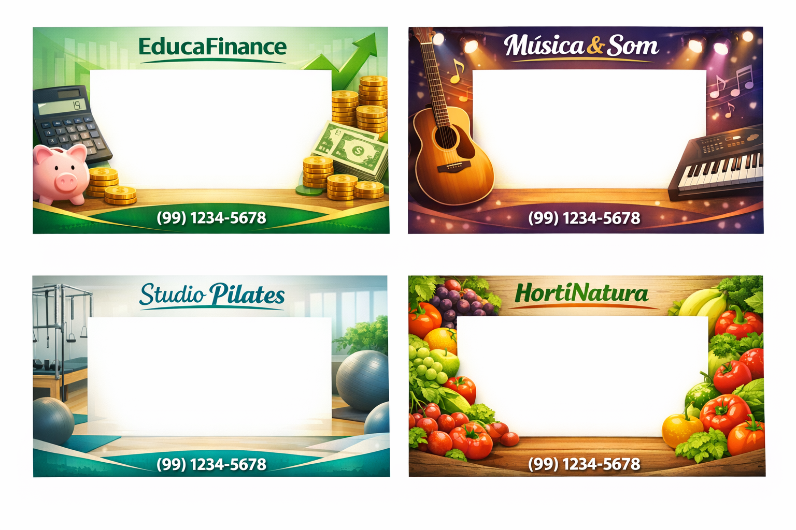
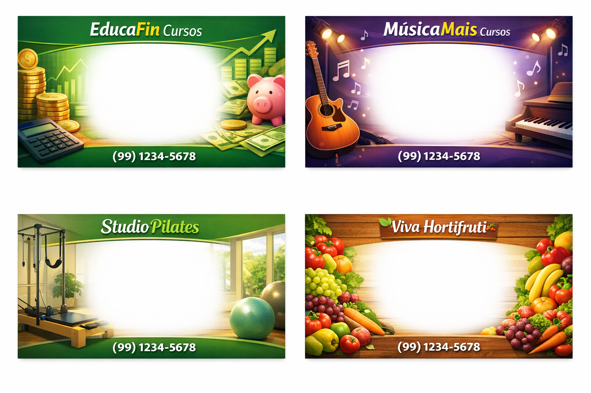
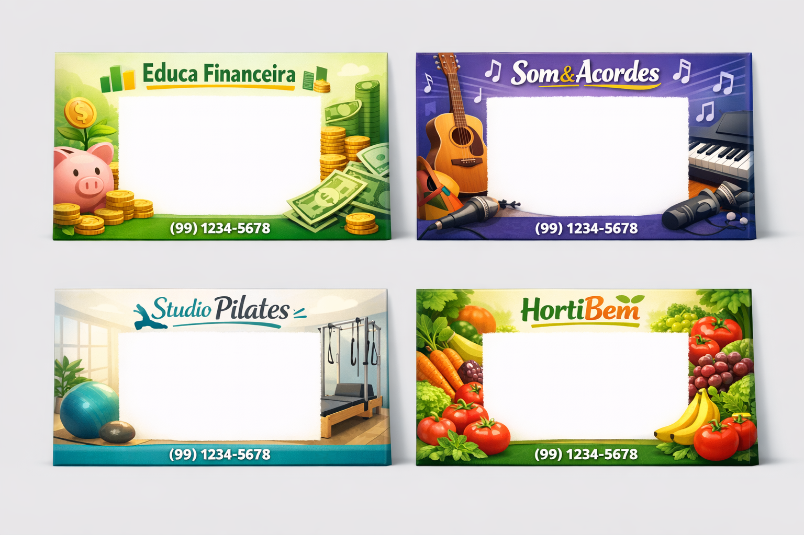
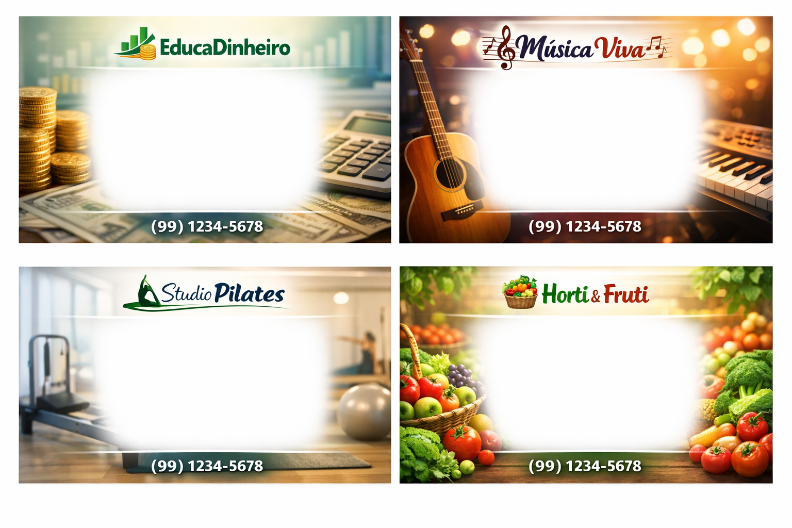
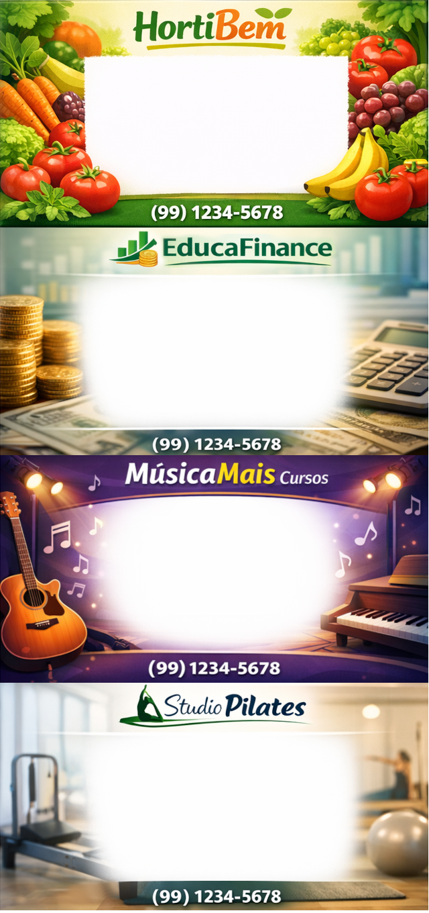

# Atividade 3: Conteúdo Interativo e Múltiplas Animações

A tarefa consiste em criar uma campanha promocional interativa em Realidade Aumentada para um negócio de escolha própria. Para isso seria necessário incluir ao menos 3 animações no modelo 3D. Dessa vez eu optei por usar o mesmo modelo da tarefa anterior, porque eu sabia que eu teria coisas novas para incluir aqui, o que me atrasaria se eu ainda parasse para criar um novo personagem só pra isso.

## Adicionando novas animações no modelo já existente
Como eu me dei bem com o Mixamo e o modelo que ia usar já tinha uma animação dessa ferramenta achei que seria apenas questão de upar o modelo de volta no site e adicionar outra animação... Errei rude ;-;

Quebrei a cabeça durante um tempo para entender como funcionava a área de _Nonlinear Animation_, fiz bastante besteira até encontrar uma explicação que funcionasse na minha versão do Blender, [aqui](https://youtu.be/y1er4qFQlCw)!

Claro que não deu certo de primeira, os pés da personagem estavam todos tortos em várias delas, em uma em especial parecia que a velha estava sendo abduzida. O segredo que eu descobri através de uma iluminada no reddit é que para ficar certinho era melhor exportar as animações junto com a mesh original. Agora sim todas as animações estavam ok!

## Imagem de referência para o futuro banner 3D
1. Para essa etapa solicitei ao Microsoft Copilot que criasse 4 banners iguais a serem usados como plano de fundo em uma área de realidade virtual. A inteligência artificial criou 4 grupos de 4 cards (😂):





Analisei um pouco e criei uma textura com todas as imagens "vencedoras":  



## Modelo 3D a partir da imagem de referência
1. Criar os cards ` .glb ` foi a parte mais fácil, somente precisei repetir o mesmo feito na tarefa anterior. O problema foi tirar do papel a minha ideia: criar uma espécie de animação ou ação onde a textura do card mudasse de acordo com a campanha selecionada. Na teoria seria a coisa mais rápida que eu já fiz, abri a **Godot Engine**, animei a visibilidade de cada card e exportei tudo como um único modelo  ` .glb ` e então...

> [!CAUTION]
> Extension KHR_node_visibility is not available on this addon version

Pois é, o Blender era incompatível com esse tipo de animação e o card sequer aparecia no babylon.js!

Daí tentei animar a área de exposição da textura dentro do Blender mesmo, até baixei um add-on a mais chamado AnimAll só pra isso (ele realmente anima tudo!), mas adivinhe? Novamente ao exportar não existia animação alguma!

> [!WARNING]
> Shader Editor nodes are not included for export to glp/gltf file

Bom, é isso. Nossa amiga, a extensão ` .glb ` é muito criteriosa sobre o que ela aceita ou não em seus arquivos... Foi daí que caiu a ficha mais óbvia: Eu sou desenvolvedora, posso fazer isso pelo código. 😅

Eu sei que a ideia da tarefa era aproveitar o mesmo card e colocar mensagens diferentes dinamicamente. Imaginei como seria se eu precisasse fazer um anúncio para um centro comercial, por exemplo, que possui várias lojas de vários segmentos diferentes... Se eu usar o mesmo card com a mesma textura, dependendo do tema poderia não combinar, já no caso de eu trocar a posição da área de uma textura única isso me daria muitas possibilidades, podendo sempre fazer mais de um anúncio em um mesmo segmento graças ao texto dinâmico, sem perder o apelo que uma arte direcionada pode causar.

## Configurando o projeto no CodePen
Aqui eu mantive o css do mesmo jeito que a sugestão da tarefa. As alterações foram feitas no html e no javascript. 

### Alterando o HTML

A começar pelo popup de escolha da campanha, sempre aberto a cada reload, me fazendo ter que colocar a mão no mouse pra esconder ele e enxergar o conteúdo. Bastou adicionar a classe ` .hidden ` convenientemente disponível no código e pronto, escondida inicialmente por padrão.

```html
<!-- ========== PAINEL DE CONTROLE INTERATIVO ========== -->
<div class="hidden" id="animation-controls">
```

A solução que pensei para conseguir alternar texturas foi usar um a-plane com a textura como material. Umas configs aqui e ali e você nem desconfiou que não era  ` .glb ` , hehehe. Também alterei os textos para terem cores que combinassem com a paleta usada pelo Copilot ao criar as artes, mas mantive as fontes, porque elas já são bem parecidas com a "IMPACT", uma das fontes mais usadas para chamar a atenção para uma informação.

O código final do html do codepen foi:
```html
<!--
  AULA 3: CAMPANHAS PROMOCIONAIS INTERATIVAS COM AR
-->
<a-scene embedded arjs xr-mode-ui="enabled: false">
  
  <a-assets>
    
  </a-assets>

  <!-- Marcador Hiro -->
  <a-marker preset="hiro"> 
    
    <a-plane 
      id="promo-card" 
      position="0 0.005 -0.05" 
      rotation="-90 0 0" 
      width="3" 
      height="1.5" 
      material="src: #spriteVertical; repeat: 1 0.25; offset: 0 0.75">
    </a-plane>
    
<!-- 
    <a-entity
      id="promo-card"
      gltf-model="https://cdn.tinyglb.com/models/86f194ed114a4c83a3d8d6fab73ef49c.glb"
      position="0 0 0"
      scale="0.07 0.07 0.07"
      rotation="0 90 0">
    </a-entity>
 -->
    
    <a-entity
      id="card-title"
      troika-text="value: Selecione uma campanha;
        font: https://cdn.jsdelivr.net/npm/@fontsource/oswald@5/files/oswald-latin-700-normal.woff;
        color: #ee6c0f;
        fontSize: 0.19;
        maxWidth: 2.0;
        anchorX: center;
        anchorY: middle;
        outlineWidth: 0%;
        outlineColor: #d27d14;
        letterSpacing: -0.005"
      position="0 0.02 -0.3"
      rotation="-90 0 0">
    </a-entity>

    <a-entity
      id="card-description"
      troika-text="value: ;
        font: https://cdn.jsdelivr.net/npm/@fontsource/oswald@5/files/oswald-latin-400-normal.woff;
        color: #062847;
        fontSize: 0.13;
        maxWidth: 2.3;
        anchorX: center;
        anchorY: middle;
        outlineWidth: 0%;
        outlineColor: #222222"
      position="0 0.02 0.0"
      rotation="-90 0 0">
    </a-entity>

    <a-entity
      id="card-price"
      troika-text="value: ;
        font: https://cdn.jsdelivr.net/npm/@fontsource/anton@5/files/anton-latin-400-normal.woff;
        color: #397916;
        fontSize: 0.19;
        maxWidth: 2.0;
        anchorX: center;
        anchorY: middle;
        outlineWidth: 8%;
        outlineColor: #fff;
        outlineBlur: 15%"
      position="0 0.02 0.3"
      rotation="-90 0 0">
    </a-entity>

    <a-entity
      id="modelo"
      gltf-model="https://cdn.tinyglb.com/models/f17f1f4c8a48404c9ed70a48b8a35874.glb"
      animation-mixer="loop: repeat"
      position="-1.0 1.0 1.0"
      scale="0.6 0.6 0.6"
      rotation="-90 0 0">
    </a-entity>

  </a-marker>

  <!-- Câmera -->
  <a-entity camera></a-entity>

</a-scene>

<!-- ========== PAINEL DE CONTROLE INTERATIVO ========== -->
<div class="hidden" id="animation-controls">

  <!-- Informação sobre o status -->
  <div id="animation-info">
    <span id="marker-status">📷 Aponte para o marcador Hiro</span>
  </div>

  <!-- Seção de Campanhas Promocionais -->
  <div class="control-section">
    <div class="section-title">🛒 Campanhas Promocionais</div>
    <p id="activity-description">
      Diferentes campanhas são configuradas via JSON no JS — sem recriar o modelo 3D.
    </p>
    <div id="animation-buttons" class="button-grid">
      <!-- Botões criados dinamicamente a partir do JSON de campanhas -->
    </div>
  </div>

  <!-- Texto de carregamento -->
  <div id="loading-text">Aguarde o carregamento do modelo 3D</div>

  <!-- Dica para personalização -->
  <div id="customization-tip">
    <small>💡 Para adicionar campanhas, edite o array <strong>CAMPAIGNS</strong> no arquivo JS</small>
  </div>
</div>

<!-- Botão toggle para abrir/fechar o menu -->
<button id="menu-toggle" aria-label="Abrir/fechar menu">☰</button>
```

### Alterando o Javascipt

Aqui era a parte mais tranquila, eu não queria mudar muito o código original, então comecei adicionando uma constante com as delimitações da textura:

```js
const TEXTURAS = [0.75, 0.50, 0.25, 0]; 
```

Depois alterei a função ` activateCampaign ` para que ela aceitasse o banner e o index atual como parâmetros e incluí a mudança de textura no fluxo já existente:

```diff
function activateCampaign(modelo, banner, campaign, index, markerStatus) {
  // 1. Troca a animação do mascote no modelo 3D
  modelo.setAttribute('animation-mixer', {
    clip: campaign.animation,
    loop: 'repeat',
  });
+ // Troca a textura presente no a-plane
+ banner.setAttribute('material', 'offset', `0 ${TEXTURAS[index]}`);

  // 2. Reposiciona, reorienta e redimensiona o personagem conforme a campanha
  modelo.setAttribute('position', campaign.position);
  modelo.setAttribute('rotation', campaign.rotation);
  modelo.setAttribute('scale',    campaign.scale);
```

O código final do javascript do codepen foi:
```js
// AULA 3: CONTROLE INTERATIVO — CAMPANHAS PROMOCIONAIS 

const TEXTURAS = [0.75, 0.50, 0.25, 0]; 
const CAMPAIGNS = [
  {
    id: 'hortifruti',
    title: 'Promoção de Frutas',
    description: 'Maçã e banana com 20% OFF',
    price: 'A partir de R$ 3,99/kg',
    animation: 'Escolhendo frutas',
    icon: '🍎',
    position: '-1.25 1.0 0.75',
    rotation: '-90 0 0',
    scale: '0.4 0.4 0.4',
  },
  {
    id: 'financas',
    title: 'Inteligência financeira',
    description: 'Gerencie finanças e evite golpes',
    price: 'Até 15% OFF',
    animation: 'Contando dinheiro',
    icon: '💰',
    position: '1.25 1.0 0.75',
    rotation: '-90 0 0',
    scale: '0.4 0.4 0.4',
  },
  {
    id: 'ukulele',
    title: 'Aulas de ukulele',
    description: 'Toque sua música favorita',
    price: 'Inscrição GRÁTIS até 31/03',
    animation: 'Tocando ukulele',
    icon: '🎵',
    position: '1.0 1.5 0.75',
    rotation: '-90 0 0',
    scale: '0.4 0.4 0.4',
  },
  {
    id: 'pilates',
    title: 'Ginástica na melhor idade',
    description: 'Mais resistência e longevidade',
    price: 'Aula experimental GRÁTIS!',
    animation: 'Fazendo pilates',
    icon: '💪',
    position: '-1.25 1.0 0.75',
    rotation: '-90 0 0',
    scale: '0.4 0.4 0.4',
  },
];

class ButtonManager {
  constructor(containerId, title) {
    this.container = document.getElementById(containerId);
    this.title = title;
    this.buttons = [];
    this.activeButton = null;
  }

  createButton(config) {
    const button = document.createElement('button');
    button.className = config.className || 'control-button';
    button.textContent = config.label;
    button.dataset.id = config.id;

    if (config.icon) {
      button.innerHTML = `${config.icon} ${config.label}`;
    }

    button.addEventListener('click', () => {
      this.setActive(button);
      if (config.onClick) {
        config.onClick(config.data);
      }
    });

    this.buttons.push(button);
    this.container.appendChild(button);
    return button;
  }

  setActive(button) {
    this.buttons.forEach((btn) => btn.classList.remove('active'));
    button.classList.add('active');
    this.activeButton = button;
  }

  clear() {
    this.container.innerHTML = '';
    this.buttons = [];
    this.activeButton = null;
  }
}

// ============================================================
// ATIVA UMA CAMPANHA PROMOCIONAL
// Troca a animação do personagem e atualiza os <a-text> do card AR
// ============================================================
function activateCampaign(modelo, banner, campaign, index, markerStatus) {
  // 1. Troca a animação do mascote no modelo 3D
  modelo.setAttribute('animation-mixer', {
    clip: campaign.animation,
    loop: 'repeat',
  });
  // Troca a textura presente no a-plane
  banner.setAttribute('material', 'offset', `0 ${TEXTURAS[index]}`);

  // 2. Reposiciona, reorienta e redimensiona o personagem conforme a campanha
  modelo.setAttribute('position', campaign.position);
  modelo.setAttribute('rotation', campaign.rotation);
  modelo.setAttribute('scale',    campaign.scale);

  // 3. Atualiza os textos dinâmicos exibidos no card A-Frame
  //    setAttribute('troika-text', 'value', ...) atualiza apenas a propriedade
  //    'value' do componente, mantendo cor, fontSize e demais config intactos.
  document.getElementById('card-title').setAttribute('troika-text', 'value', campaign.title);
  document.getElementById('card-description').setAttribute('troika-text', 'value', campaign.description);
  document.getElementById('card-price').setAttribute('troika-text', 'value', campaign.price);

  // 4. Reflete a campanha ativa no status da interface
  markerStatus.textContent = `✅ ${campaign.icon} ${campaign.title}`;
}

function iniciarControles() {
  const modelo = document.querySelector('#modelo');
  const marker = document.querySelector('a-marker');
  const banner = document.getElementById('promo-card');
  const markerStatus = document.getElementById('marker-status');
  const loadingText = document.getElementById('loading-text');

  if (!modelo || !marker) {
    console.error('Elementos necessários não encontrados!');
    return;
  }

  const animButtonManager = new ButtonManager('animation-buttons', 'Campanhas');

  // --- LOGICA DE STATUS DO SEGUNDO GRUPO (MARKER) ---
  marker.addEventListener('markerFound', () => {
    markerStatus.textContent = '✅ Marcador detectado! Carregando modelo...';
    markerStatus.className = 'found';
  });

  marker.addEventListener('markerLost', () => {
    markerStatus.textContent = '📍 Marcador perdido. Aponte novamente.';
    markerStatus.className = 'lost';
  });

  const timeoutId = setTimeout(() => {
    if (markerStatus.className !== 'found') {
      loadingText.innerHTML =
        '<strong>Dica:</strong> Aponte para o marcador Hiro!<br><small>Baixe em: <a href="https://raw.githubusercontent.com/AR-js-org/AR.js/master/data/images/hiro.png" target="_blank" style="color: #4ECDC4;">bit.ly/hiro-marker</a></small>';
    }
  }, 10000);

  // Quando o modelo 3D termina de carregar
  modelo.addEventListener('model-loaded', () => {
    clearTimeout(timeoutId);
    loadingText.style.display = 'none';

    // Ativa a primeira campanha automaticamente
    activateCampaign(modelo, banner, CAMPAIGNS[0], 0, markerStatus);

    // Cria um botão para cada campanha definida no JSON
    CAMPAIGNS.forEach((campaign, index) => {
      const button = animButtonManager.createButton({
        id: campaign.id,
        label: `${campaign.icon} ${campaign.title}`,
        className: 'anim-button',
        data: campaign,
        onClick: (data) => activateCampaign(modelo, banner, data, index, markerStatus),
      });
      if (index === 0) animButtonManager.setActive(button);
    });
  });

  // Tratamento de erro ao carregar o modelo
  modelo.addEventListener('model-error', () => {
    clearTimeout(timeoutId);
    markerStatus.textContent = '❌ Erro ao carregar modelo. Verifique a URL.';
    loadingText.innerHTML = '<strong>❌ Erro ao carregar o modelo 3D</strong>';
    loadingText.style.color = '#f5576c';
  });
}

function initMenuToggle() {
  const toggleBtn = document.getElementById('menu-toggle');
  const panel = document.getElementById('animation-controls');

  if (!toggleBtn || !panel) return;

  toggleBtn.addEventListener('click', () => {
    const isHidden = panel.classList.toggle('hidden');
    toggleBtn.textContent = isHidden ? '☰' : '✖';
  });
}

if (document.readyState === 'loading') {
  document.addEventListener('DOMContentLoaded', () => {
    iniciarControles();
    initMenuToggle();
  });
} else {
  setTimeout(() => {
    iniciarControles();
    initMenuToggle();
  }, 500);
}
```

E o resultado final a partir da camera virtual do meu computador foi:


### Conclusão
Através dessa tarefa ficou claro que às vezes precisamos parar um pouco e pensar na melhor forma de fazer cada coisa, nem sempre é tão óbvio, algumas vezes deixar algo para o código faz mais sentido e é mais ágil.