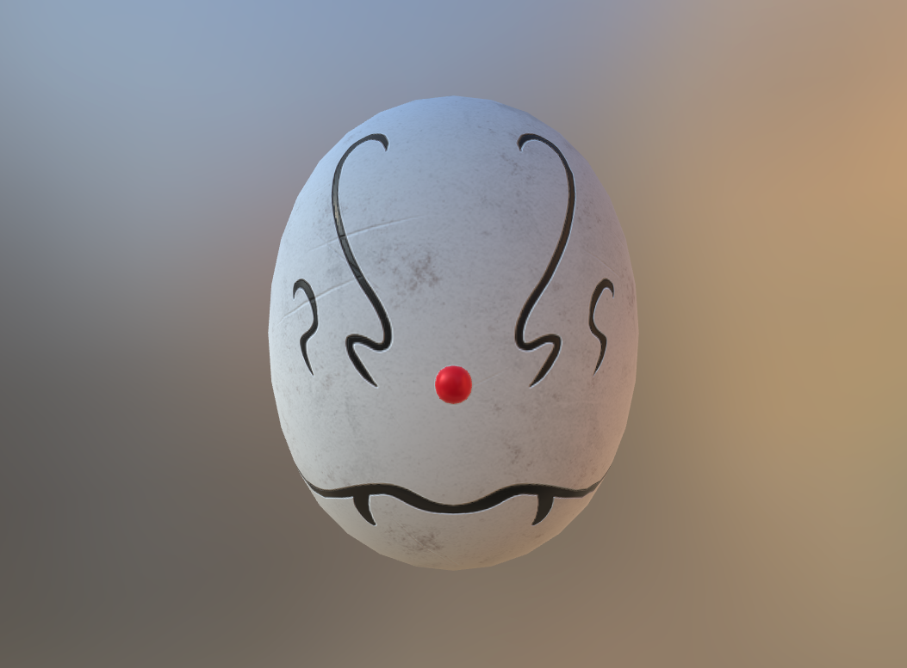
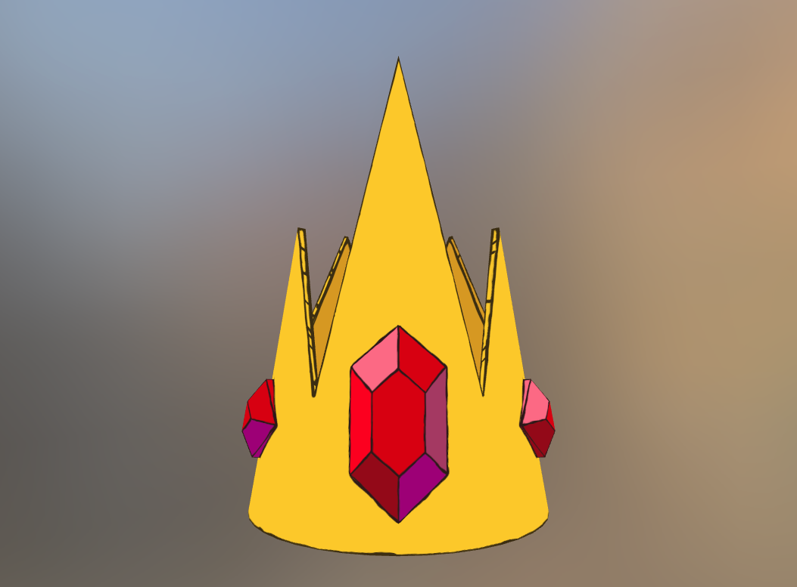
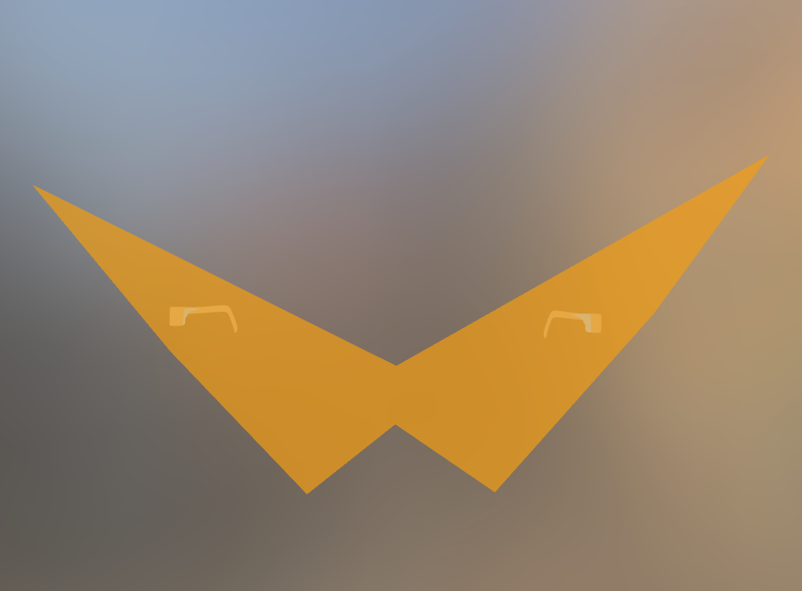
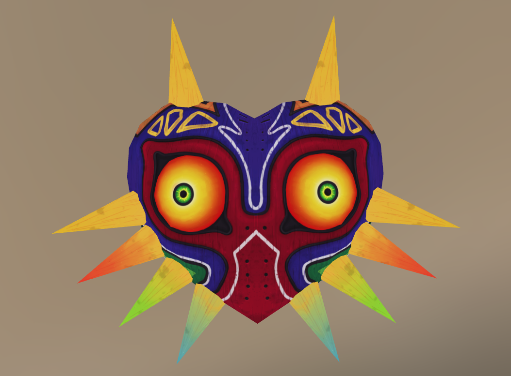
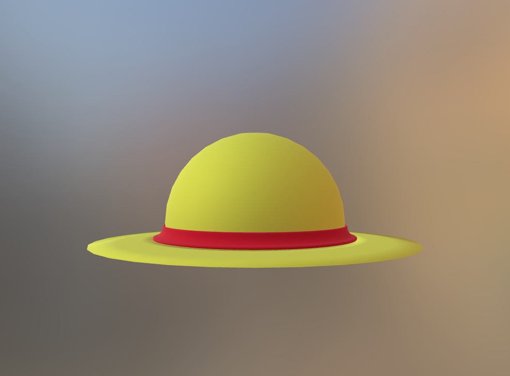
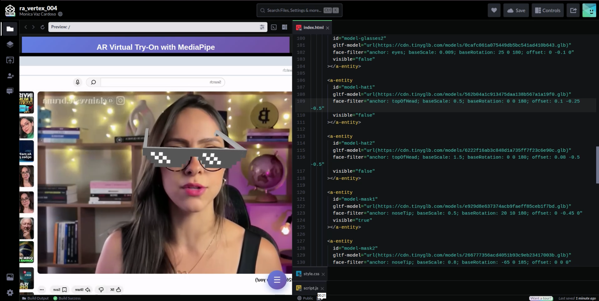
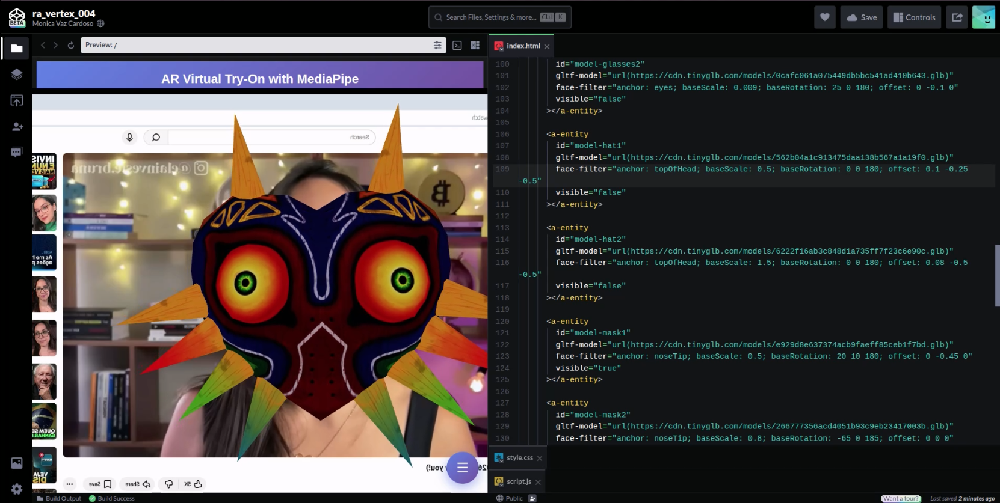

# Atividade 4: Conteúdo Interativo e Múltiplas Animações

Hoje o exercício consiste em criar um adereço facial em Realidade Aumentada (máscara, óculos ou chapéu) utilizando um modelo 3D no formato ` .GLB ` para uma aplicação de detecção facial utilizando o MediaPipe e A-Frame. 

## Sketchfab

Conforme sugerido na descrição da tarefas, decidi por buscar modelos no Sketchfab e depois upá-los no TinyGLB. Eles foram:

<div>
    
    
    
    
    
</div>

E podem ser encontrados nos seguintes links:

- [Máscara anti-magia](https://skfb.ly/pEJKL)
- [Coroa do Rei Gelado](https://skfb.ly/oVUSq)
- [Óculos do Kamina](https://skfb.ly/6SnU6)
- [Máscara de Majora](https://skfb.ly/FDGu)
- [Chapéu de palha](https://skfb.ly/oq9ZL)

O critério de escolha foi o tamanho do arquivo principalmente, mas como podem ver, aproveitei a oportunidade para incluir algumas referências à cultura geek/otaku atual.

## Codepen  

Utilizei a câmera virtual do OBS transmitindo um vídeo do youtube para testar o posicionamento dos adereços e acabei notando que dependendo do tamanho da janela de exibição o objeto pode acabar em um local diferente da intenção, portanto, a fins de reprodução, o melhor resultado será alcançado ao utilizar o layout de 50% visualização e 50% código:



Também identifiquei um comportamento estranho, onde independente de qual ancoragem eu usasse (eyes, topOfHead, noseTip) um dos modelos tinha tendência a distorcer (alterar scale) sempre que eu tentava alterar a posição vertical do mesmo, de modo que acabei optando por deixar nessa altura em vez de ocupar todo o rosto:



### Códigos

Para essa atividade as alterações mais significativas estão na marcação HTML, conforme segue:

```html
      <!--
        Modelos 3D dos Filtros Faciais
        Cada entidade usa:
        - gltf-model: carregador de modelos 3D embutido do A-Frame (substitui o THREE.GLTFLoader)
        - face-filter: nosso componente customizado que posiciona o modelo no rosto
        - visible="false": começa oculto até o usuário selecionar o filtro
      -->
      <a-entity
        id="model-glasses1"
        gltf-model="url(https://cdn.jsdelivr.net/gh/hiukim/mind-ar-js@1.2.5/examples/face-tracking/assets/glasses/scene.gltf)"
        face-filter="anchor: eyes; baseScale: 0.016; baseRotation: 0 0 180; offset: 0 0 0"
        visible="false"
      ></a-entity>

      <a-entity
        id="model-glasses2"
        gltf-model="url(https://cdn.tinyglb.com/models/0cafc061a075449db5bc541ad410b643.glb)"
        face-filter="anchor: eyes; baseScale: 0.009; baseRotation: 25 0 180; offset: 0 -0.1 0"
        visible="false"
      ></a-entity>

      <a-entity
        id="model-hat1"
        gltf-model="url(https://cdn.tinyglb.com/models/562b04a1c913475daa138b567a1a19f0.glb)"
        face-filter="anchor: topOfHead; baseScale: 0.5; baseRotation: 0 0 180; offset: 0.1 -0.25 -0.5"
        visible="false"
      ></a-entity>

      <a-entity
        id="model-hat2"
        gltf-model="url(https://cdn.tinyglb.com/models/6222f16ab3c848d1a735ff7f23c6e90c.glb)"
        face-filter="anchor: topOfHead; baseScale: 1.5; baseRotation: 0 0 180; offset: 0.08 -0.5 -0.5"
        visible="false"
      ></a-entity>

      <a-entity
        id="model-mask1"
        gltf-model="url(https://cdn.tinyglb.com/models/e929d8e637374acb9faeff85ceb1f7bd.glb)"
        face-filter="anchor: noseTip; baseScale: 0.5; baseRotation: 20 10 180; offset: 0 -0.45 0"
        visible="true"
      ></a-entity>

      <a-entity
        id="model-mask2"
        gltf-model="url(https://cdn.tinyglb.com/models/266777356acd4051b93c9eb23417003b.glb)"
        face-filter="anchor: noseTip; baseScale: 0.8; baseRotation: -65 0 185; offset: 0 0 0"
        visible="false"
      ></a-entity>
```

### Conclusão

Toda a capacitação foi uma ótima experiência de modo geral e estou ansiosa pelos próximos passos a serem dados!